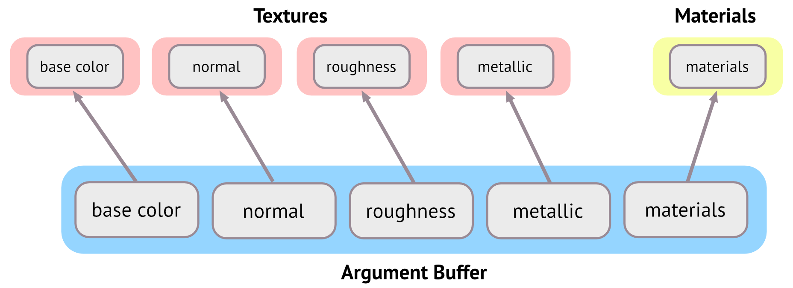
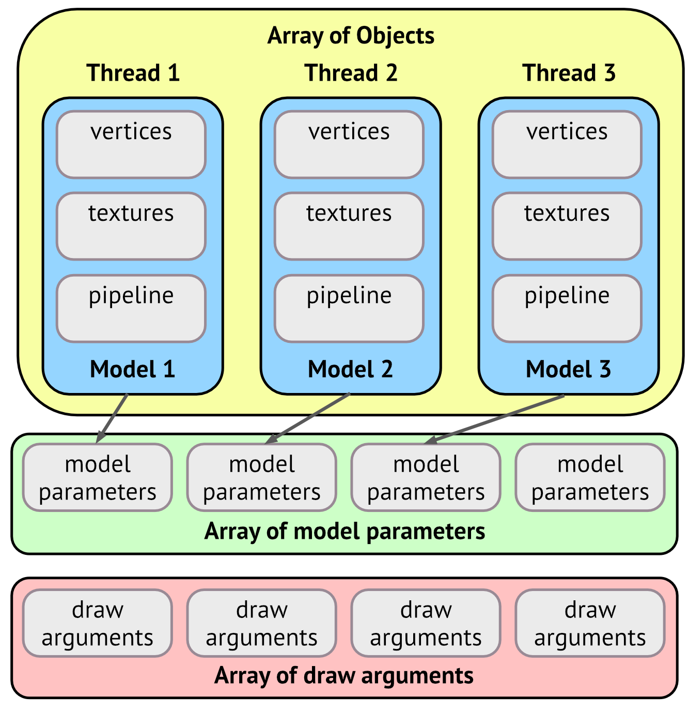
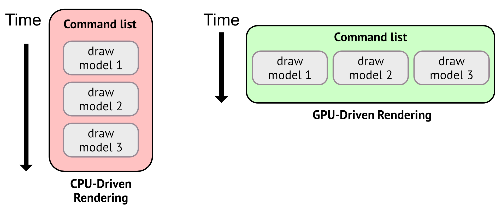
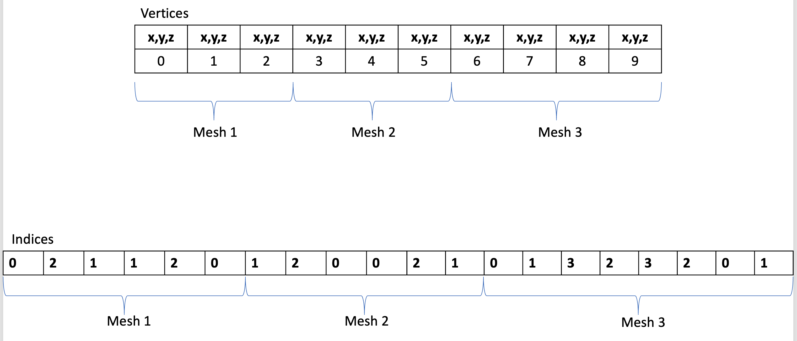

- [Primary Classes](#primary-classes)
- [Mesh Draw Pipeline](#mesh-draw-pipeline)
    - [1. FPrimitiveSceneProxy -\> FMeshBatch](#1-fprimitivesceneproxy---fmeshbatch)
        - [FMeshBatchElement](#fmeshbatchelement)
        - [FMeshBatch](#fmeshbatch)
        - [FMeshElementCollector](#fmeshelementcollector)
    - [2. FMeshBatch -\> FMeshDrawCommand](#2-fmeshbatch---fmeshdrawcommand)
        - [FMeshDrawCommand](#fmeshdrawcommand)
        - [FMeshDrawCommandPassSetupTask](#fmeshdrawcommandpasssetuptask)
        - [FMeshDrawCommandInitResourcesTask](#fmeshdrawcommandinitresourcestask)
        - [FMeshDrawCommandPassSetupTaskContext](#fmeshdrawcommandpasssetuptaskcontext)
        - [FVisibleMeshDrawCommand](#fvisiblemeshdrawcommand)
        - [FMeshPassProcessor](#fmeshpassprocessor)
        - [FRayTracingMeshProcessor](#fraytracingmeshprocessor)
    - [3. FMeshDrawCommand -\> RHICommandList](#3-fmeshdrawcommand---rhicommandlist)
        - [FDeferredShadingSceneRenderer::RenderPrePass](#fdeferredshadingscenerendererrenderprepass)
        - [FParallelMeshDrawCommandPass!!!](#fparallelmeshdrawcommandpass)
        - [FInstanceCullingContext](#finstancecullingcontext)
        - [FParallelCommandListBindings](#fparallelcommandlistbindings)
        - [FDrawVisibleMeshCommandsAnyThreadTask](#fdrawvisiblemeshcommandsanythreadtask)
        - [FRDGParallelCommandListSet: FParallelCommandListSet](#frdgparallelcommandlistset-fparallelcommandlistset)
        - [EDepthDrawingMode](#edepthdrawingmode)
    - [Static Mesh](#static-mesh)
    - [Other Codes](#other-codes)
        - [EVertexFactoryFlags](#evertexfactoryflags)
        - [EFVisibleMeshDrawCommandFlags](#efvisiblemeshdrawcommandflags)
        - [BlendMode](#blendmode)
        - [MaterialShadingModel](#materialshadingmodel)
        - [MaterialDomain](#materialdomain)
        - [MeshPass](#meshpass)
- [Optimal](#optimal)
        - [Debug Infos](#debug-infos)

<small><i><a href='http://ecotrust-canada.github.io/markdown-toc/'>Table of contents generated with markdown-toc</a></i></small>

# Primary Classes
- UWorld
- ULevel
- USceneComponent  
    拥有transform及支持attachment, 但没有rendering或collision  
- UPrimitiveComponent  
    继承自SceneComponent, 包含或生成一些几何排序, 一般可以被渲染或者用于collision data.  
    各种几何类型都有一些子类,但最常用的是ShapeComponents(Capsule, Sphere, Box), StaticmeshComponent, SkeletalMeshComponent.  
    ShapeComponents生成的几何用于collision detection,而没有渲染. StaticMeshComponent和SkeletalMeshComponent包含预构建的渲染几何体,同时可以collision detection.  
- ULightComponent

- FScene  
    UWorld的渲染器版本. 对象(primitives和lights)只有在添加到FScene后才会存在于renderer, 即registering a component.  
    渲染线程拥有FScene中的所有状态, 游戏线程不可直接修改.  
- FPrimitiveSceneProxy  
    UPrimitiveComponent的渲染器版本. 为渲染线程镜像UPrimitiveComponent的状态. 存在于engine module.  
- FPrimitiveSceneInfo  
    对应于UPrimitiveComponent和FPrimitiveSceneProxy的内部渲染器状态, 存在于renderer module.  

- FSceneView  
    a projection from scene space into a 2d screen region.  
    FScene中单个视图地引擎表示. 一个场景可以被不同地视图渲染(FSceneRender::Render), 多个编辑器视口或分屏地多个视图. 每帧都会构造新的View.  
- FViewInfo  
    a FSceneView with additional state used by the scene renderer.  
    view地内部渲染器表达式, 存在于renderer module.  
- FSceneViewState  
    ViewState存储了一个视图地私有渲染器信息,以便跨帧使用. 游戏中每个ULocalPlayer有一个view state.  
- FSceneRenderer  
    每帧创建,封装帧间的临时数据.  

- FMeshBatchElement  
    a batch mesh element definition.  
- FMeshBatch  
    a batch of mesh elements, all with the same material and vertex buffer.  
- FMeshDrawCommand  
  完整描述了一个mesh pass draw call, FMeshDrawCommand(static primitives)在Primitive AddToScene时缓存,以便vertex factories使用(没有每帧或每视图的shader binding changes).  
  Dynamic Instancing在FMeshDrawCommand级别运行,以实现鲁棒性.  
  增加per-command shader bindings将会减少Dynamic Instancing的效率, 但渲染总是正确的.  
  command引用的任何资源必须在command的整个生命周期内保持活跃.FMeshDrawCommand不负责资源的生命周期管理.  
  cached FMeshDrawCommand的uniform buffers引用, RHIUpdateUniformBuffer使得在没有changing bindings时可以访问着色器中的每帧数据.  
  resource bindings/PSO/Draw command parameters/Non-pipeline state.  

- FMeshPassProcessor  
    mesh processors的基类. 将从scene proxy实现接收到的FMeshBatch draw descriptions转换为用于RHI command list的FMeshDrawCommands.  
- 在调用图形API之前, 引擎需要做很多操作和优化, 如 Occlusion Culling/Static|Dynamic Batching/Dynamic Instancing/Cache State|Command/Generate Intermidiate Commands for translate to graphic api...  
    Dynamic Batching: 引擎将共享材质球的不同对象组合到单个draw call.  
    Dynamic Instancing: 引擎将具有相同网格和材质的相同对象的多个实例渲染到单个draw call.  
    Static Batching: 将多个静态对象(不可移动/变化频率小)组合成更大的单个网格, 以便渲染时仅单个draw call.  

 

| GameThread |         RenderingThread |
| --- | --- |
| UWorld |              FScene |
| UPrimitiveComponent |     FPrimitiveSceneProxy/FPrimitiveSceneInfo |
|                      |  FSceneView/FViewInfo |
| ULocalPlayer          |  FSceneViewState |
| ULightComponent       |  FLightSceneProxy/FLightSceneInfo |

 

|Engine Module | Renderer Module|
| --- | --- |
| UWold | FScene |
| UPrimitiveComponent/FPrimitiveSceneProxy | FPrimitiveSceneInfo |
| FSceneView | FViewInfo |
| ULocalPlayer | FSceneViewState |
| ULightComponent/FLightSceneProxy | FLightSceneInfo |

 

# Mesh Draw Pipeline

### 1. FPrimitiveSceneProxy -> FMeshBatch
场景渲染器FSceneRenderer在渲染之初, 执行可见性测试和剔除, 以剔除被遮挡或被隐藏的物体, 在此阶段的末期会调用GatherDynamicMeshElements(主要是dynamic primitives), 从当前场景所有的FPrimitiveSceneProxy中筛选并构建FMeshBatch, 放置在Collector.  

 

- FSceneRenderer::Render (DeferredShadingRenderer/MobileShadingRenderer)  
- FDeferredShadingSceneRenderer::InitViews  
- FSceneRenderer::ComputeViewVisibility  
- FSceneRenderer::GatherDynamicMeshElements  
- GetDynamicMeshElements(const TArray<const FSceneView*>& Views, const FSceneViewFamily& ViewFamily, uint32 VisibilityMap, FMeshElementCollector& Collector)  
  收集图元的dynamic mesh elements. 仅GetViewRelevance声明了dynamic relevance的才会调用. 针对每组可能被渲染的views的渲染线程调用.  
  游戏线程的状态如UObjects必须将其属性镜像到 primitiveSceneProxy 以避免race conditions. 渲染线程必须禁止解引用UObjects.  
  收集到的mesh elements将会多次使用, 任何内存引用的生命周期必须和Collector一样长(即不应该引用stack memory).  
  此函数不应修改proxy,仅简单收集渲染事物的描述. proxy的更新需要从游戏线程或外部事件推送.  

  - 比如skeletal mesh component  
    - FSkeletalMeshSceneProxy::GetDynamicMeshElements  
    - FSkeletalMeshSceneProxy::GetMeshElementsConditionallySelectable  
    - FSkeletalMeshSceneProxy::GetDynamicElementsSection  
      根据当前LODIndex,获取LODData, 遍历当前LOD的每个LODSection,通过Collector构建FMeshBatch, 设置MeshBatchElement/vertex factory/material/OverlayMaterial等一系列参数.  
      OverlayMaterial会再分配一份MeshBatch,设置MeshIdInPrimitive(LODData.RenderSections.Num())以确保渲染在base mesh之上.  

- FMeshElementCollector::AddMesh(int32 ViewIndex, FMeshBatch& MeshBatch)  
- ComputeDynamicMeshRelevance: 计算当前mesh dynamic element的MeshBatch会被哪些MeshPass引用, 加入到每个View的PrimitiveViewRelevanceMap.  

##### FMeshBatchElement
  记录单个网格元素的数据, 如primitive uniform buffer/index buffer/user data/primitiveId  

- FRHIUniformBuffer* PrimitiveUniformBuffer  
  对于从场景数据中手动提取图元数据的vertex factory, 必须为空. 此时使用FPrimitiveSceneProxy::UniformBuffer.  

- const TUniformBuffer<FPrimitiveUniformShaderParameters>* PrimitiveUniformBufferResource  
  Primitive uniform buffer用于渲染, 当PrimitiveUniformBuffer为空时使用. 允许为尚未初始化的uniform buffer设置一个FMeshBatchElement.  

- const FIndexBuffer* IndexBuffer  

- FMeshBatchElementDynamicIndexBuffer DynamicIndexBuffer  
  针对特定view, 用于动态排序三角形的对象.(如 per-object order-independent-transparency).  

- uint32* InstanceRuns/FSplineMeshSceneProxy* SplineMeshSceneProxy  
  当没有SplineProxy, Instance runs, 由NumInstances指定数量. Run structure是[StartInstanceIndex, EndInstanceIndex]  
  当为SplineProxy时, 指向proxy的指针.  

- const void* UserData  
- void* VertexFactoryUserData  
  意图取决于vertex factory. 如FGPUSkinPassthroughVertexFactory: element index in FGPUSkinCache::CachedElements  

- FRHIBuffer* IndirectArgsBuffer  
- uint32 IndirectArgsOffset  

- EPrimitiveIdMode PrimitiveIdMode  
  由渲染器分配.  
  PrimID_FromPrimitiveSceneInfo: primitiveId将从FMeshBatch对应的FPrimitiveSceneInfo中获取. primitive data将从GPUScene persistent primitiveBuffer中提取.  
  PrimID_DynamicPrimitiveShaderData: renderer将会上传primitive data,从FMeshBatchElement的PrimitiveUniformBufferResource上传到GPUScene PrimitiveBuffer的结尾处, 然后分配偏移至DynamicPrimitiveIndex. 用于绘制的primitiveId将计算为Scene->NumPrimitives + FMeshBatchElement的DynamicPrimitiveIndex.  
  PrimID_ForceZero: 不支持Instancing. 在此配置中必须设置View.PrimitiveSceneDataOverrideSRV,以便控制在PrimitiveId == 0时提取的什么shader.  

- FirstIndex  
- NumPrimitives  
  当为0时,将会使用IndirectArgsBuffer  

- NumInstances  
  若InstanceRuns有效, 这个实际是InstanceRuns的runs数量  
- BaseVertexIndex  
- MinVertexIndex  
- MaxVertexIndex  
- UserIndex  
- MinScreenSize  
- MaxScreenSize  

- InstancedLODIndex  
- InstancedLODRange  
- bUserDataIsColorVertexBuffer  
- bIsSplineProxy  
- bIsInstanceRuns  
- bForceInstanceCulling  
- bPreserveInstanceOrder  

- const FMeshBatchDynamicPrimitiveData* DynamicPrimitiveData  
  dynamic primitives的源实例场景数据(source instance scene data)和有效负载数据(payload data). 必须为拥有超过单个instance的dynamic primitives提供.指向对像的生命周期预期会匹配或超过mesh batch自身的生命周期.  
- DynamicPrimitiveIndex  
- DynamicPrimitiveInstanceSceneDataOffset  

- GetNumPrimitives()  

 

##### FMeshBatch
  网格元素的批次.所有网格元素拥有相同的mesh和vertex buffer.  

- TArray<FMeshBatchElement,TInlineAllocator<1> > Elements  
  FMeshBatchElements批次. TInlineAllocator<1>表明Elements数组至少有1个元素.  
- const FVertexFactory* VertexFactory  
  渲染所需的vertex factory.  
- const FMaterialRenderProxy* MaterialRenderProxy  
  渲染所需的material proxy  

- const FLightCacheInterface* LCI  
  为特定的mesh缓存光照的接口  

- FHitProxyId BatchHitProxyId  

- TessellationDisablingShadowMapMeshSize  
- MeshIdInPrimitive  
  相同图元的绘制进行稳定排序.  

- LODIndex  
  LOD的平滑过渡.  
- SegmentIndex  

- ReverseCulling  
- bDisableBackfaceCulling  

- CastShadow  
  是否可用于shadow render passes.  
- bUseForMaterial  
  是否可用于需求material输出的render passes  
- bUseForDepthPass  
- bUseAsOccluder  
- bWireframe  
- Type : PT_NumBits  
  PT_TriangleList/PT_TriangleStrip/PT_LineList/PT_QuadList/PT_PointList/PT_RectList...  
- DepthPriorityGroup : SDPG_NumBits  

- bCanApplyViewModeOverrides  
  view mode重载是否应用到此mesh,如unlit,wireframe.  
- bUseWireframeSelectionColoring  
  是否对待batch为特殊viewmodes的选中,如wireframe. 如FStaticMeshSceneProxy  
- bUseSelectionOutline  
  batch是否接受选中轮廓. proxies which support selection on a per-mesh batch basis.  
- bSelectable  
  是否可通过编辑器选择来选中mesh batch, 即 hit proxies.  
- bDitheredLODTransition  

- bRenderToVirtualTexture  
- RuntimeVirtualTextureMaterialType : RuntimeVirtualTexture::MaterialType_NumBits  

- bOverlayMaterial  
  rendered with overlay material.  
- CastRayTracedShadow  

- IsTranslucent/IsDecal/IsDualBlend/UseForHairStrands/IsMasked/QuantizeLODIndex/GetNumPrimitives/HasAnyDrawCalls  
- PreparePrimitiveUniformBuffer  
  若禁止GPU scene,备份使用primitive uniform buffer. mobile上的vertex shader在GPUScene开启时可能仍使用PrimitiveUB  

##### FMeshElementCollector
封装从各个FPrimitiveSceneProxy classes中收集到的meshes. 在收集完成后可以指定需要等待的任务列表,以实现多线程并行处理的同步  

- FPrimitiveDrawInterface* GetPDI(int32 ViewIndex)  
  访问PDI以绘制lines/sprites...  
- FMeshBatch& AllocateMesh()  
  分配可以被collector安全引用的FMeshBatch(生命周期足够长). 返回的引用不会应进一步的AllocateMesh的调用而失效.  
- GetDynamicIndexBuffer/GetDynamicVertexBuffer/GetDynamicReadBuffer: dynamic bufer pools  
- GetMeshBatchCount(uint32 ViewIndex): 给定view收集的MeshBatches的数量.  
- GetMeshElementCount(uint32 ViewIndex)  
- AddMesh(int32 ViewIndex, FMeshBatch& MeshBatch)  
- RegisterOneFrameMaterialProxy(FMaterialRenderProxy* Proxy)  
- AllocateOneFrameResource: 分配临时资源, FMeshBatch可以安全引用, 以便添加到collector.  
- ShouldUseTasks/AddTask/ProcessTasks  
- GetFeatureLevel  
- DeleteTemporaryProxies  
- SetPrimitive(const FPrimitiveSceneProxy* InPrimitiveSceneProxy,  FHitProxyId DefaultHitProxyId)  
- ClearViewMeshArrays  
- AddViewMeshArrays  

- TChunkedArray<FMeshBatch> MeshBatchStorage: 使用TChunkedArray,新增元素时从不会重新分配.  
- TArray<TArray<FMeshBatchAndRelevance, SceneRenderingAllocator>*, TInlineAllocator<2, SceneRenderingAllocator> > MeshBatches: 用来渲染的meshes.  
- TArray<int32, TInlineAllocator<2, SceneRenderingAllocator> > NumMeshBatchElementsPerView  
- TArray<FSimpleElementCollector*, TInlineAllocator<2, SceneRenderingAllocator> > SimpleElementCollectors: point/line/triangle/sprite等简单元素的收集器.  
- TArray<FSceneView*, TInlineAllocator<2, SceneRenderingAllocator>> Views  
- TArray<uint16, TInlineAllocator<2, SceneRenderingAllocator>> MeshIdInPrimitivePerView  
- TArray<FMaterialRenderProxy*, SceneRenderingAllocator> TemporaryProxies: 添加materi render proxy, 在析构FMeshElementCollector时自动销毁  
- FSceneRenderingBulkObjectAllocator& OneFrameResources  
- const FPrimitiveSceneProxy* PrimitiveSceneProxy  
- FGlobalDynamicIndexBuffer* DynamicIndexBuffer  
- FGlobalDynamicVertexBuffer* DynamicVertexBuffer  
- FGlobalDynamicReadBuffer* DynamicReadBuffer  
- ERHIFeatureLevel::Type FeatureLevel  
- const bool bUseAsyncTasks  
- TArray<TFunction<void()>, SceneRenderingAllocator> ParallelTasks  
- TArray<FGPUScenePrimitiveCollector*, TInlineAllocator<2, SceneRenderingAllocator>> DynamicPrimitiveCollectorPerView  
  追踪动态图元数据,用于为每个view上传到GPU Scene  

### 2. FMeshBatch -> FMeshDrawCommand

- FSceneRenderer::SetupMeshPass  
  遍历所有的MeshPass类型  
  根据ShadingPath和PassType获取EMeshPassFlags, 仅执行EMeshPassFlags::MainView, 过滤EMeshPassFlags::CachedMeshCommands(static primitives在addToScene时便已处理).  
  Mobile下BasePass或者MobileBasePassCSM需要在shadow pass之后进行合并和排序.  
  根据着色路径(Mobile/Deferred)和Pass类型来创建对应的FMeshPassProcessor.  
  获取指定Pass的FParallelMeshDrawCommandPass对象, 调用DispatchPassSetup.  
  根据(r.MeshDrawCommands.LogDynamicInstancingStats)可以打印下一帧MeshDrawCommand实例的统计信息.  

- FParallelMeshDrawCommandPass::DispatchPassSetup  
  调度visible mesh draw command处理任务,为绘制准备此pass. 包括生成dynamic mesh draw commands, draw sorting, draw merging.
  设置FMeshDrawCommandPassSetupTaskContext的数据.  
  包括 基础属性, translucency sort key, 交换内存命令列表(MeshDrawCommands/DynamicMeshCommandBuildRequests/MobileBasePassCSMMeshDrawCommands)  
  基于最大绘制数量在渲染线程预分配资源(PrimitiveIdBufferData/MeshDrawCommands/TempVisibleMeshDrawCommands).  
  若可以并行执行:  
    若允许按需shaderCreation(IsOnDemandShaderCreationEnabled), 直接添加任务(FMeshDrawCommandPassSetupTask)至TaskGraph系统.  
    否则将任务(FMeshDrawCommandPassSetupTask)作为前置, 添加到另一个任务(FMeshDrawCommandInitResourcesTask)中.  
    此时缓存任务至TaskEventRef, 以便在执行drawing task之前,确保setup task已完成.  
  若不可以并行执行, 则直接执行FMeshDrawCommandPassSetupTask任务, 若不允许按需shaderCreation,则再执行FMeshDrawCommandInitResourcesTask任务.  

- FMeshDrawCommandPassSetupTask  
  并行设置mesh draw commands的任务. 包含生成dynamic mesh draw command,sorting,merging...  

- FMeshPassProcessor::AddMeshBatch  
在创建一系列的任务后, 当TaskGraphSystem并行执行到每个任务时,依据不同的mesh pass processor来转换FMeshBatch为FMeshDrawCommand.  

> 如 FBasePassMeshProcessor::AddMeshBatch  
  若标记了bUseForMaterial, 查询materialRenderProxy中可以使用的material.  
FBasePassMeshProcessor::TryAddMeshBatch: 仅绘制opaque materials.  
    渲染volumetric translucent self-shadowing/point indirect lighting及self shadowing/directional light self shadowing translucency.  
    或者根据不同的光照贴图和质量等级,调用Process处理  
FBasePassMeshProcessor::Process  
    根据不同的LightMapPolicyType获取base pass shaders(vertexShader/pixelShader)  
    设置render state: blendState/depthStencil/viewUniformBuffer/InstancedViewUniformBuffer/PassUniformer/NaniteUniformBuffer/StencilRef  
    设置排序参数: basePass(VertexShaderHash|PixelShaderHash|Masked), Translucent(MeshIdInPrimitive|Distance|Priority), Generic(VertexShaderHash|PixelShaderHash).  

> 如 FDepthPassMeshProcessor::AddMeshBatch  
    需标记MeshBatch.bUseForDepthPass.  
    默认Mobile rendering不使用depth prepass.  
      但r.Mobile.EarlyZPassOnlyMaterialMasking可以开启仅maskedMaterial使用EarlyZPass.  
      r.Mobile.EarlyZPass  
      MobileAmbientOcclusion  
      distance field shadow to render shadow mask texture on mobile deferred, normal shadows need to rendered separately because of handling lighting channels.  
      with clustered lighting and shadow of local light endabled(movable spot light shadow), shadows will render to shadow mask texture on mobile forward,lighting channels are handled in base pass shader.  
      这些情况下也会允许all opaque(full prepass, every object must be draw and every pixel must match the base pass depth)  
    通过occluder flags 和其他设置来过滤pass.(occluder/static objects或者moveable/dynamic mesh command by screen size)  
    使用DDM_AllOpaqueNoVelocity会在此跳过绘制, 将会在velocity pass 写入depth+velocity.  
    若bDraw为真,则查询mesh可使用的material,调用TryAddMeshBatch.  

FDepthPassMeshProcessor::TryAddMeshBatch  
    仅允许opaque或者masked blend mode, 必须支持render in depth pass  
    判别是否使用默认材质.  
    重载设置MeshFillMode/MeshCullMode  
    根据PositionOnly/PositionAndNormal for vertex factory, 调用Process  

FDepthPassMeshProcessor::Process  
    获取vertexShader/pixelShader for depthPassShaders.(TDepthOnlyVS<bPositionOnly>/FDepthOnlyPS)  
    设置pipeline state: blendState/DepthStencilState/StencilRef  
    计算排序参数: 若开启r.EarlyZSortMasked,设置SortKey.BasePass, 否则设置SortKey.Generic  
    调用BuildMeshDrawCommands  

- FMeshPassProcessor::BuildMeshDrawCommands  
    传入参数: MeshBatch,BatchElementMask,PrimitiveSceneProxy,MaterialRenderProxy,MaterialResource,DrawRenderState,PassShaders,MeshFillMode,MeshCullMode,SortKey,MeshPassFeatures,ShaderElementData.  

    构造FMeshDrawCommand  
      设置StencilRef,PrimitiveType  
      为shader bindings分配内存(ShaderLayouts)  
      构造没有render target state的FGraphicsMinimalPipelineStateInitializer  
        设置PrimitiveType,ImmutableSamplerState.  
        根据vertexInputStreamType(position或者positionAndNormal)获取对应VertexFactory的vertexDeclaration, 以及Shaders(vertex|pixel|geometry shaderResource/shaderIndex)来设置BoundShaderState.  
        根据MeshFillMode和MeshCullMode来设置RasterizerState.  
        设置BlendState/DepthStencilState  
        设置DrawShadingRate(EVRSShadingRate). (Variable Rate Shading 允许屏幕的不同部分有不同的着色速率1x1~4x4)  
        若PSO precaching开启,计算hash.  
      设置vertexStream及PrimitiveIdStreamIndex. 根据VertexStreamType(Default/PositionOnly/PositionAndNormalOnly)来获取不同数据来源.  
      设置VertexShader/PixelShader/GeometryShader的shader bindings数据, 从MeshMaterialShader/MaterialShader/LightMapPolicyType从获取各种各样的uniform buffers.  
      设置调试数据  
      遍历FMeshBatch的所有FMeshBatchElements  
        收集每个element的vertexShader/PixelShader/GeometryShader的shader bindings(primitiveUniformBuffer或者PrimitiveUniformBufferResource).  
        针对使用GPUScene的vertexFactory, 默认是不允许绑定PrimitiveUniformBuffer, 因Vertex Factory 计算一个PrimitiveId per-instance. 这会打断auto-instancing.  shader应使用GetPrimitiveData(PrimitiveId).Member替代Primitive.Member. 但在mobile上允许Primitive uniform buffer for vertex shader.  
        获取MeshDrawCommandPrimitiveIdInfo, 根据element的PrimitiveIdMode(PrimID_FromPrimitiveSceneInfo/PrimID_DynamicPrimitiveShaderData).  PrimID_FromPrimitiveSceneInfo模式下,是static primitive,从PrimitiveSceneInfo获取drawPrimitiveId和InstanceSceneDataOffset.  PrimID_DynamicPrimitiveShaderData模式下是dynamic primitive, 从element自身获取.  
        调用FMeshPassDrawListContext::FinalizeCommand.    

- FMeshPassDrawListContext::FinalizeCommand  
  - FDynamicPassMeshDrawListContext: context used when building FMeshDrawCommand for one frame only. (for dynamic primitives.)
      FinalizeCommand  
        FMeshDrawCommand::SetDrawParametersAndFinalize: 设置参数IndexBuffer/FirstIndex/NumPrimitives/NumInstances/VertexParams(IndirectArgs)  
        设置新的FVisibleMeshDrawCommand,填充MeshDrawCommand等参数, 加入到DrawList列表  

  - FCachedPassMeshDrawListContext (for static primitives )  
    FCachedPassMeshDrawListContextImmediate::FinalizeCommand   
      设置MeshDrawCommand的draw command parameters, PSO  
      若bUseGPUScene为真,将FMeshDrawCommand加入到Scene.CachedMeshDrawCommandStateBuckets.  
      否则加入到Scene.CachedDrawLists, 一个pass中每个FStaticMesh仅支持一个FMeshDrawCommand.  
      在lowest free index处分配, 'r.DoLazyStaticMeshUpdate' 可以更有效率的收缩TSparseArray.  

    FCachedPassMeshDrawListContextDeferred::FinalizeCommand  

##### FMeshDrawCommand
  完整的描述了一个mesh pass draw call  

- resource bindings  
ShaderBindings: 封装单个mesh draw command的shader bindings  
VertexStreams: 内联分配vertex input bindings的数量. FLocalVertexFactory bindings符合inline storage.  
IndexBuffer  

- PSO  
CachedPipelineId: 为快速比较,唯一表达FGraphicsMinimalPipelineStateInitializer  

- draw command parameters  
FirstIndex  
NumPrimitives  
NumInstances  

VertexParams(BaseVertexIndex,NumVertices)/IndirectArgs(Buffer,Offset)  
PrimitiveIdStreamIndex  

- Non-pipeline state  
StencilRef  

PrimitiveType: access for dynamic instancing on GPU  

- MatchesForDynamicInstancing: 动态实例化的匹配规则.  
  CachedPipelineId/StencilRef/ShaderBindings/VertexStreams/PrimitiveIdStreamIndex/IndexBuffer/FirstIndex/NumPrimitives/NumInstances  
  ShaderBindings比较ShaderFrequencyBits/ShaderLayouts(looseData|sampler|srv|uniformbuffer)  
  有图元数量时比较VertexParams, 否则比较IndirectArgs  

- SubmitDrawBegin  
设置和缓存PSO: RHICmdList.SetGraphicsPipelineState(PipelineState也会缓存在PipelineStateCache)  
设置和缓存Stencil: RHICmdList.SetStencilRef  
设置和缓存顶点数据: RHICmdList.SetStreamSource from MeshDrawCommand.VertexStreams(InstanceBuffer or VertexBuffer)  
设置和缓存ShaderBinding: 遍历ShaderLayouts, 分别设置Vertex/Pixel/Geometry, UniformBuffer/Sampler/BindlessParameters/SRV/Texture/other shader parameters.  

- SubmitDrawEnd  
RHICmdList.DrawIndexedPrimitive/RHICmdList.DrawIndexedPrimitiveIndirect/RHICmdList.DrawPrimitive/RHICmdList.DrawPrimitiveIndirect  

SubmitDrawIndirectBegin  
SubmitDrawIndirectEnd  
SubmitDraw  

GetDynamicInstancingHash  
InitializeShaderBindings  
SetStencilRef  
SetDrawParametersAndFinalize  

##### FMeshDrawCommandPassSetupTask
  判别是否为mobile base pass.  
  mobile base pass 其最终列表是基于CSM可视性从两个mesh passes中创建出来的.  

  若为mobileShadingBasePass:  
    MergeMobileBasePassMeshDrawCommands: 先合并MeshDrawCommands, 为了选择恰当的shader,基于CSM visibility合并附带BasePassCSM的mobile basePass. 即以MeshCommandsCSM替代MeshCommands.  
    GenerateMobileBasePassDynamicMeshDrawCommands: 然后依然基于CSM visibility,使用normal base pass processor或CSM base pass processor来生成mesh draw commands.  
    遍历所有的FMeshBatch, 采用MobilePassCSMPassMeshProcessor或者PassMeshProcessor来生成mesh draw commands. 同理处理DynamicMeshCommandBuildRequests.  
  若不是mobileShadingBasePass:  
    调用GenerateDynamicMeshDrawCommands  
    构建FDynamicPassMeshDrawListContext实例,以传递PassMeshProcessor生成的绘制命令  
    遍历处理所有的DynamicMeshBatches和StaticMeshBatches, 调用不同mesh pass type的FMeshPassProcessor::AddMeshBatch.  

  若生成了MeshDrawCommands, 还有一些后续处理.  
    ApplyViewOverridesToMeshDrawCommands: 为已存在的mesh draw commands应用view overrides.(eg. reverse culling mode for rendering planar reflections)  
    计算mobile base pass的mesh sort keys:  
      r.Mobile.MeshSortingMethod: 0-按状态排序, 大致front to back(默认) 1-严格front to back排序  
      maskBlendMode/bBackground primitives/pipelineId/stateBucketId/primitiveDistance/pipelineDistance/stateBucketDistance  
    translucent mesh排序:  
        SortByDistance: 基于相机中心点到边界球体的中心点距离(3d)  
        SortByProjectedZ: 基于post-projection Z  
        SortAlongAxis: 基于投射到固定轴(2d)  
        若bInverseSorting为真(OIT), 使用front-to-back替代back-to-front排序.  
    若bUseGPUScene为真, 执行FInstanceCullingContext::SetupDrawCommands.  
        为所有的网格分配间接参数slots,以使用instancing, 增加填充间接调用和index&id buffers的命令,隐藏所有共享相同state bucket ID的命令.  

##### FMeshDrawCommandInitResourcesTask
shader initialization task. commands生成之后将会在渲染线程运行. 初始化CachedPixelShader/CachedGeometryShader/CachedVertexShader  

##### FMeshDrawCommandPassSetupTaskContext
parallel mesh draw command pass setup task context  

View  
Scene  
ShadingPath  
ShaderPlatform  
PassType  
bUseGPUScene  
bDynamicInstancing  
bReverseCulling  
bRenderSceneTwoSided  
BasePassDepthStencilAccess(read/write/mask)  
DefaultBasePassDepthStencilAccess  

MeshPassProcessor  
MobileBasePassCSMMeshPassProcessor  
DynamicMeshElements  
DynamicMeshElementsPassRelevance  

InstanceFactor  
NumDynamicMeshElements  
NumDynamicMeshCommandBuildRequestElements  

//FVisibleMeshDrawCommand数组,仅用于visibility和sorting  
MeshDrawCommands: FMeshCommandOneFrameArray  
MobileBasePassCSMMeshDrawCommands  

//FStaticMeshBatch 在scene segment构造时通过图元定义的从不改变的mesh  
DynamicMeshCommandBuildRequests: TArray<const FStaticMeshBatch*, SceneRenderingAllocator>  
MobileBasePassCSMDynamicMeshCommandBuildRequests  

//每帧存储mesh draw command的构建, 采用TChunkedArray.  
MeshDrawCommandStorage: FDynamicMeshDrawCommandStorage  

//一组FGraphicsMinimalPipelineStateInitializer, 是没有render target state的pipeline state, 包含如blendState,rasterizerState,depthStencilState,primitiveType  
MinimalPipelineStatePassSet: FGraphicsMinimalPipelineStateSet  

NeedsShaderInitialisation  

PrimitiveIdBufferData  
PrimitiveIdBufferDataSize  
TempVisibleMeshDrawCommands  

//update translucent mesh sort keys  
TranslucencyPass  
TranslucentSortPolicy  
TranslucentSortAxis  
ViewOrigin  
ViewMatrix  
PrimitiveBounds  

VisibleMeshDrawCommandsNum  
NewPassVisibleMeshDrawCommandsNum  
MaxInstances  

InstanceCullingContext  
InstanceCullingResult  

##### FVisibleMeshDrawCommand
    存储确定可视的mesh draw command的信息, 以进行进一步的visibility processing.  
    此数据仅为initViews操作(visibility, sorting)存储数据, FMeshDrawCommand存储draw submission的数据.  

MeshDrawCommand: 单独存储meshDrawCommand,以避免在排序期间提取其数据.  
SortKey: sort key for non state based sorting(e.g. sort translucent draws by depth).  
PrimitiveIdInfo: DrawPrimitiveId/ScenePrimitiveId/InstanceSceneDataOffset/bIsDynamicPrimitive  
PrimitiveIdBufferOffset: 为此pass构建的primitiveIds buffer的偏移  
StateBucketId: dynamic instancing state bucket ID. 拥有相同StateBucketId的任意commands可以合并到one draw call with instancing. 若值为-1,则此绘制不在state bucket中,应该通过其他因素来排序.  

RunArray: passing sub-selection of instances through to the culling.  
NumRuns  

MeshFillMode: for view overrides  
MeshCullMode  

Flags: EFVisibleMeshDrawCommandFlags  

##### FMeshPassProcessor
mesh processor的基类, 从scene proxy实现接收的FMeshBatch绘制描述变换到FMeshDrawCommand, 以便为RHI command list准备.  

- EMeshPass::Type MeshPassType
- const FScene* RESTRICT Scene
- ERHIFeatureLevel::Type FeatureLevel
- const FSceneView* ViewIfDynamicMeshCommand
- FMeshPassDrawListContext* DrawListContext

- AddMeshBatch: 由子类实现, 每个子类通常对应EMeshPass的一个通道.  
  FDepthPassMeshProcessor::AddMeshBatch  
  FBasePassMeshProcessor::AddMeshBatch  
  FAnisotropyMeshProcessor::AddMeshBatch  
  FSkyPassMeshProcessor::AddMeshBatch  
  FSingleLayerWaterPassMeshProcessor::AddMeshBatch  
  FSingleLayerWaterDepthPrepassMeshProcessor::AddMeshBatch  
  FShadowDepthPassMeshProcessor::AddMeshBatch  
  FCustomDepthPassMeshProcessor::AddMeshBatch  
  FTranslucencyDepthPassMeshProcessor::AddMeshBatch  
  FLightmapDensityMeshProcessor::AddMeshBatch  
  FMeshDecalMeshProcessor::AddMeshBatch  

  FLightmapGBufferMeshProcessor::AddMeshBatch  
  FVLMVoxelizationMeshProcessor::AddMeshBatch  
  FUVLightCardPassProcessor::AddMeshBatch  
  FRenderTraceMeshProcessor::AddMeshBatch  
  FLandscapeGrassWeightMeshProcessor::AddMeshBatch  
  FLandscapePhysicalMaterialMeshProcessor::AddMeshBatch  
  FDebugViewModeMeshProcessor::AddMeshBatch  
  FDistortionMeshProcessor::AddMeshBatch  
  FEditorPrimitivesBasePassMeshProcessor::AddMeshBatch  
  FHairRasterMeshProcessor::AddMeshBatch  
  FHairMaterialProcessor::AddMeshBatch  
  FLumenFrontLayerTranslucencyGBufferMeshProcessor::AddMeshBatch  
  FLumenCardMeshProcessor::AddMeshBatch  
  FLumenTranslucencyRadianceCacheMarkMeshProcessor::AddMeshBatch  
  FNaniteMeshProcessor::AddMeshBatch  
  FHitProxyMeshProcessor::AddMeshBatch  
  FEditorSelectionMeshProcessor::AddMeshBatch  
  FEditorLevelInstanceMeshProcessor::AddMeshBatch  
  FOpaqueVelocityMeshProcessor::AddMeshBatch  
  FVolumetricCloudRenderViewMeshProcessor::AddMeshBatch  
  FVolumetricCloudRenderShadowMeshProcessor::AddMeshBatch  
  FVoxelizeVolumeMeshProcessor::AddMeshBatch  
  FRuntimeVirtualTextureMeshProcessor::AddMeshBatch  

- CollectPSOInitializers  
- ComputeMeshOverrideSettings  
- ComputeMeshFillMode  
- ComputeMeshCullMode  

- BuildMeshDrawCommands  
- AddGraphicsPipelineStateInitializer  

##### FRayTracingMeshProcessor

### 3. FMeshDrawCommand -> RHICommandList
每个Pass都对应一个FMeshPassProcessor, 每个FMeshPassProcessor保存了该Pass需要绘制的所有FMeshDrawCommand, 以便渲染器在恰当的顺序触发并渲染.
此处指定PrePass.  

##### FDeferredShadingSceneRenderer::RenderPrePass
draw a depth pass to avoid overdraw in the other passes.  

- FDeferredShadingSceneRenderer::RenderPrePassHMD: 头戴设备  
- 若允许RasterStencilDither, 调用AddDitheredStencilFillPass, 为每个view执行FPixelShaderUtils::AddFullscreenPass  
- 若并行DepthPass(r.ParallelPrePass)为真, 遍历Views:  
  - 构造FMeshPassProcessorRenderState, 设置BlendState/DepthStencilState(禁止color writes, 允许depth tests和writes).  
  - GraphBuilder.AllocParameters 分配FDepthPassParameters, 设置ViewUniforBuffer及render target for depth/stencil texture  
  - 获取DepthPass对应的ParallelMeshDrawCommandPass, 调用FParallelMeshDrawCommandPass::BuildRenderingCommands, 设置PassParameters.InstanceCullingDrawParams  
  - 调用GraphBuilder.AddPass, 延迟执行(DepthPassParallel):  
    - 构造FRDGParallelCommandListSet, 将PassParameters转换为FParallelCommandListBindings(renderPassInfo和StaticUniformBuffer).设置高优先级.  
    - 调用FParallelMeshDrawCommandPass::DispatchDraw  
  - 调用RenderPrePassEditorPrimitives  
- 若没有并行DepthPass, 同上处理, 仅在调用FParallelMeshDrawCommandPass::DispatchDraw时, 直接提交所有的meshDrawCommands  
- 若DepthPass.bDitheredLODTransitionsUseStencil为真, dithered transition stencil mask clear for all active viewports. 调用GraphBuilder.AddPass, 等待执行的pass: 计算所有views的视口尺寸,调用DrawClearQuad.  

##### FParallelMeshDrawCommandPass!!!
Parallel mesh draw command processing and rendering. 封装两个并行任务---mesh command setup task and drawing task.  

- DispatchPassSetup: dispatch visible mesh draw command process task, 为渲染准备此pass. 包含生成dynamic mesh draw commands, draw sorting and draw merging.  

- BuildRenderingCommands:  
sync with setup task, run post-instance culling job to create commands and instance ID lists and optionally vertex instance data. 需要在DispatchPassSetup之后,DispatchDraw之前执行, 但不能在global instance culling 之前执行.  
  - 若允许TaskContext.InstanceCullingContext才会执行接下来的逻辑.  
  - 调用WaitForMeshPassSetupTask  
  - 调用TaskContext.InstanceCullingContext.BuildRenderingCommands  
  - 调用TaskContext.InstanceCullingResult.GetDrawParameters  

- WaitForSetupTask: sync with setup task  
- DispatchDraw: dispatch visible mesh draw command draw task.  
  - 若存在InstanceCullingDrawParams,则构造FMeshDrawCommandOverrideArgs.  
  - 若并行执行(ParallelCommandListSet)  
    - 收集前置条件(FGraphEventArray): 来自TaskEventRef和ParallelCommandListSet  
    - 根据线程数和最大绘制数量/每个CommandList的最小绘制数(64),取最小任务数量以及计算每个任务的绘制数量.  
    - 遍历每个任务  
      - 分配新的FRHICommandList, 默认设置 graphics pipeline. 设置BeginRenderPass/SetStaticUniformBuffers/SetViewport  
      - 新建TGraphTask(FDrawVisibleMeshCommandsAnyThreadTask). 在执行此任务的末期会调用RHICmdList.EndRenderPass/RHICmdList.FinishRecording  
      - 调用ParallelCommandListSet->AddParallelCommandList: command list加入QueuedCommandLists,以便追踪并行绘制是否完成.  
  - 若没有并行执行  
    - WaitForMeshPassSetupTask 等待MeshDrawCommands完成构建.  
    - 若TaskContext.bUseGPUScene为真, 调用TaskContext.InstanceCullingContext.SubmitDrawCommands, 否则调用SubmitMeshDrawCommandsRange. 此时RHICmdList来自RDG传入的参数FRHICommandListImmediate. 都会遍历MeshDrawCommands, 调用FMeshDrawCommand::SubmitDraw, 通用的传入MeshDrawCommand/PipelineStateSet/RHICmdList, 而GPUScene会重载参数(FMeshDrawCommandOverrideArgs).  

- WaitForTasksAndEmpty  
- SetDumpInstancingStats  
- HasAnyDraw  
- InitCreateSnapshot  
- FreeCreateSnapshot  
- IsOnDemandShaderCreationEnabled  
GL rhi 不支持多线程shaderCreation, 但引擎可以配置为除了RT外不能运行mesh drawing tasks.  
FRHICommandListExecutor::UseParallelAlgorithms若为真, 则允许on demand shader creation  
r.MeshDrawCommands.AllowOnDemandShaderCreation: 0-总是在渲染线程创建RHI shaders, 在执行其他MDC任务之前. 1-若RHI支持多线程着色器创建,则在提交绘制时,按需在task threads创建.  

- FMeshDrawCommandPassSetupTaskContext TaskContext  
- FGraphEventRef TaskEventRef  
- FString PassNameForStats  
- bool bHasInstanceCullingDrawParameters  
- int32 MaxNumDraws: maximum number of draws for this pass. 用于在渲染线程预分配资源. 确保若没有任何绘制, 则MaxNumDraws=0.  

- DumpInstancingStats  
- WaitForMeshPassSetupTask  

##### FInstanceCullingContext
- SubmitDrawCommands
传入参数VisibleMeshDrawCommands/PipelineStateSet/OverrideArgs/StartIndex/NumMeshDrawCommands/InstanceFactor/RHICmdList  
若并行执行CommandListSet, StartIndex/NumMeshDrawCommands这两个参数便是每个Task的起始索引及处理的数量, 否则便是一次性处理所有MeshDrawCommands.  
根据StartIndex/NumMeshDrawCommands遍历MeshDrawCommands:  
  根据OverrideArgs(FMeshDrawCommandOverrideArgs), 若bUseIndirect, 设置IndirectArgsByteOffset/IndirectArgsBuffer, 否则设置InstanceFactor.
  设置InstanceDataByteOffset
  调用FMeshDrawCommand::SubmitDraw, 调用SubmitDrawBegin/SubmitDrawEnd. [to this](#fmeshdrawcommand)

##### FParallelCommandListBindings
marshal data from RDG pass into the parallel command list set. 从pass parameters struct中获取renderPassInfo和staticUniformBuffers.  

- SetOnCommandList  
    RHICmdList.BeginRenderPass  
    RHICmdList.SetStaticUniformBuffers  

- FRHIRenderPassInfo RenderPassInfo  
- FUniformBufferStaticBindings StaticUniformBuffers  

##### FDrawVisibleMeshCommandsAnyThreadTask
- RHICmdList  
- InstanceCullingContext  
- VisibleMeshDrawCommands  
- GraphicsMinimalPipelineStateSet  
- OverrideArgs  
- InstanceFactor  
- TaskIndex  
- TaskNum  

- DoTask: 调用FInstanceCullingContext::SubmitDrawCommands  

##### FRDGParallelCommandListSet: FParallelCommandListSet

##### EDepthDrawingMode
DDM_None: teted at a higher level.  
DDM_NonMaskOnly: opaque materials only.  
DDM_AllOccluders: opaque and masked materials, 且允许bUseAsOccluder.  
DDM_AllOpaque: full prepass, every object must be drawn and every pixel must match the base pass depth.  
DDM_MaskedOnly: masked materials only  
DDM_AllOpaqueNoVelocity: full prepass, 但dynamic geometry将会在Velocity pass渲染  

### Static Mesh

- FPrimitiveSceneInfo::AddToScene  
- FPrimitiveSceneInfo::AddStaticMeshes  
并行执行所有SceneInfos(ParallelForTemplate), 针对每个primitiveSceneInfo, 构造FBatchingSPDI, 调用Proxy->DrawStaticElements.  

  - FStaticMeshSceneProxy::DrawStaticElements  
  构造FMeshBatch:  
    若存在RuntimeVirtualTextureMaterialTypes,构造runtime virtual texture mesh elements  
    shadow-only mesh或者用于deferred renderer的depth pass也会构造一份FMeshBatch  
    若OverlayMaterial不为空,也会构造MeshBatch.  

  - FBatchingSPDI->DrawMesh  
  构造FStaticMeshBatch, 放置在PrimitiveSceneInfo->StaticMeshes.  
  若未开启GPUScene或者mobile会设置PrimitiveUniformBuffer(来自PrimitiveSceneProxy), 否则为空.  
  bSupportsCachingMeshDrawCommands依赖于FMeshBatch仅有一个FMeshBatchElement和VertexFactory支持缓存网格绘制命令.  
  特殊情况如Volumetric self shadow mesh commands(cast volumetric translucent shadow), 外部纹理映射到immutable samplers都会禁止缓存.  
  构造FStaticMeshBatchRelevance, 放置在PrimitiveSceneInfo->StaticMeshRelevances  

- FPrimitiveSceneInfo::CacheMeshDrawCommands  
计算出并行数量NumBatches, 构造相同数量的FCachedPassMeshDrawListContextDeferred, 并行执行SceneInfos.  

遍历每个SceneInfo, 设置StaticMeshCommandInfos, 记录SceneInfo中的每个staticMesh在SceneInfos的索引和在StaticMeshes中的索引,构造为FMeshInfoAndIndex. 但需满足非volumetric self shadow mesh command和支持缓存网格绘制命令.  
遍历每个meshPass, 获取各个pass对应的PassMessProcessor, 将FMeshBatch转换为FMeshDrawCommands, 最终放置在Scene.CachedMeshDrawCommandStateBuckets(bUseGPUScene)或者Scene.CachedDrawLists. 同时更新对应的SceneInfo->StaticMeshRelevances.  

### Other Codes

##### EVertexFactoryFlags
  UsedWithMaterials  
  SupportsStaticLighting  
  SupportsDynamicLighting  
  SupportsPrecisePrevWorldPos  
  SupportsPositionOnly  
  SupportsCachingMeshDrawCommands  
  SupportsPrimitiveIdStream  
  SupportsNaniteRendering  
  SupportsRayTracing  
  SupportsRayTracingDynamicGeometry  
  SupportsRayTracingProceduralPrimitive  
  SupportsLightmapBaking  
  SupportsPSOPrecaching  
  SupportsManualVertexFetch  
  DoesNotSupportNullPixelShader  
  SupportsGPUSkinPassThrough  
  SupportsComputeShading  

##### EFVisibleMeshDrawCommandFlags
  MaterialUsesWorldPositionOffset: 为给定的材质球激活WPO  
  HasPrimitiveIdStreamIndex: 支持primitive ID stream(dynamic instancing和GPU-Scene instance culling)  
  ForceInstanceCulling: 强制独立于图元来剔除单个实例  
  PreserveInstanceOrder: 实例在draw command中保存初始绘制顺序. 目前仅支持non-mobile  

##### BlendMode
materials: Opaque/Masked/Translucent/Additive/Modulate/AlphaComposite/AlphaHoldout  
strata materials: Opaque/Masked/TranslucentGreyTransmittance/TranslucentColoredTransmittance/ColoredTransmittanceOnly/AlphaHoldout  

##### MaterialShadingModel
Unlit  
DefaultLit  
Subsurface  
PreintegratedSkin  
ClearCoat  
SubsurfaceProfile  
Hair  
Cloth  
Eye  
SingleLayerWater  
ThinTranslucent  
Strata  

##### MaterialDomain
Surface: 材质的属性描述3d表面  
DeferredDecal: 材质属性描述延迟贴花,将会映射到贴花的frustum  
LightFunction: 材质属性描述光照的分布  
Volume: 3d volume, only in voxellization pass.  
PostProcess: custom post process pass  
UI: UMG或Slate UI  
RuntimeVirtualTexture: runtime virtual texture(deprecated).  

##### MeshPass
DepthPass  
BasePass  
AnisotropyPass  
SkyPass  
SingleLayerWaterPass  
SingleLayerWaterDepthPrepass  
CSMShadowDepth  
VSMShadowDepth  
Distortion  
Velocity  
TranslucentVelocity  
TranslucencyStandard  
TranslucencyAfterDOF  
TranslucencyAfterDOFModulate  
TranslucencyAfterMotionBlur  
TranslucencyAll  
LightmapDensity  
CustomDepth  
MobileBasePassCSM  
VirtualTexture  
LumenCardCapture  
LumenCardNanite  
LumenTranslucencyRadianceCacheMark  
LumenFrontLayerTranslucencyGBuffer  
DitheredLODFadingOutMaskPass  
NaniteMeshPass  
MeshDecal  
HitProxy  
HitProxyOpaqueOnly  
EditorLevelInstance  
EditorSelection  

# Optimal
- Indirect Draw (GPU-Driven Rendering for DX11/DX12/Vulkan/Metal/OpenGL(4.6?))  
  - 渲染大型场景的常见方法是遍历每个模型,在每次绘制调用前绑定其资源(vertex buffers,index buffers,descriptors...).  
  每次绑定资源在command buffer generation(如调用vkCmdBindVertexBuffer) 和 rendering(如绑定资源)中都会有负载.  
  而使用GPU rendering和indirect call可以从GPU buffer查询commands(vkCmdDrawIndexIndirect).  
  Draw calls can be generated from the GPU.  
  an array of draw calls can be called at once, reducing command buffer overhead.  
  间接命令的信息由结构体VkDrawIndexedIndirectCommand提供.  
  此结构体包含绘制信息vertices/indices.既然结构体允许vertex/index buffers的偏移(fistIndex/vertexOffset),来自场景的多个模型可以放置到单个index buffer/vertex buffer,并仅绑定一次, 且index buffer的每个部分都是零索引.因此对单个绘制调用来说,类型uint16_t的index buffer在vertices数量超过2^16时依然可以使用.  
   
  
  [vulkan ref](https://docs.vulkan.org/samples/latest/samples/performance/multi_draw_indirect/README.html)  
  
   

  - argument buffers, resource heaps, indirect command buffers. move the command list creation to the GPU.
   
   
   
   
   
   

  [metal ref](https://www.kodeco.com/books/metal-by-tutorials/v2.0/chapters/15-gpu-driven-rendering)

   

  
  [openGL ref](https://ktstephano.github.io/rendering/opengl/mdi)

   

- TChunkArray: 在新的元素增加时不会重新分配内存(todo mem stack)  
- TInlineAllocator: 针对频繁访问的小数据容器, 在容器内事先分配好内存,而无需添加时再heap allocation,仅在超出NumInlineElements时,再采用SecondaryAllocator  
template <uint32 NumInlineElements, typename SecondaryAllocator = FDefaultAllocator>  
using TInlineAllocator = TSizedInlineAllocator<NumInlineElements, 32, SecondaryAllocator>  

template <uint32 NumInlineElements, typename SecondaryAllocator = FDefaultAllocator64>  
using TInlineAllocator64 = TSizedInlineAllocator<NumInlineElements, 64, SecondaryAllocator>  

FMeshElementCollector& Collector 从各个FPrimitiveSceneProxy classes中收集meshses.  
TChunkedArray<FMeshBatch> MeshBatchStorage  
TArray<FSceneView*, TInlineAllocator<2, SceneRenderingAllocator>> Views: 默认在容器内分配两个View的空间  

- FGraphicsPipelineCache  

- FVisibilityTaskData(UE5.4)  
 此类管理特定的scene renderer相关的所有视图的visibility computation相关的所有状态.  
 当处于parallel mode,复杂的task graph处理每一个可视性阶段,pipelines results从一个阶段到另一个阶段, 可以避免 major join/fork sync points. 而dynamic mesh elements gather是个例外, 其受限于render thread.  
 平台可能不会从parallelism受益或者就不支持并行模式, 同时也支持render-thread中心模式,即在渲染线程处理可视性,且使用task threads来支持一些并行.  

 所有视图的可视性处理都是独立的,每个视图执行pipelined task work的多个阶段.  
 |||
 | --- | --- |
 | Frustum Cull      | frustum/distance culled for primitives  |
 | Occlusion Cull    | culled against occluders for primitives |
 | Compute Relevance | 查询图元获取视图关联信息,标识和发出dynamic primitives, static meshes过滤到各个mesh passes  |

所有图元需执行的阶段:
|||
| --- | --- |
| Gather Dynamic Mesh Elements(GDME) | 以view mask查询标识dynamic relevance的图元,以支持dynamic meshes |
| Setup MeshPasses | 启动任务为static/dynamic meshes生成 mesh draw commands |

 

为促进处理每一阶段发出的数据,最终为下一阶段产生load balanced tasks, visibility pipeline利用command pipes, 即在阶段间运行的serial queues,以为下一阶段启动任务.  
每个视图有两个pipes: OcclusionCull和Relevance. OcclusionCull也可以处理occlusion tasks,或在occlusion禁止时扮演relevance pipe. relevance pipe仅启动relevance tasks.  
渲染线程执行GDME阶段,此阶段同步所有视图的compute relevance阶段. 一旦所有GDME任务完成后,setup mesh passes将会运行.  
当渲染器仅有一个视图时,GDME利用command pipe尽可能快的处理来自关联性的请求,实现一些关联性的重叠,减少关键路径.  
有多个视图时,有必要事先同步,因收集需要每个dynamic primitives的view mask. 最终GDME支持两种路径来处理动态图元: index list或者view bit mask. index list支持动态图元列表,view bits假定为0x1. view bit mask需要通过扫描view mask数组中的非零元素来导出dynamic primitive indices.  

##### Debug Infos

r.MeshDrawCommands.LogDynamicInstancingStats = "1"  
LogRenderer: Instancing stats for ShadowDepth WholeScene split0  
LogRenderer:    4 Mesh Draw Commands in 4 instancing state buckets  
LogRenderer:    Largest 1  
LogRenderer:    1.0 Dynamic Instancing draw call reduction factor  
LogRenderer: Instancing stats for ShadowDepth WholeScene split1  
LogRenderer:    11 Mesh Draw Commands in 11 instancing state buckets  
LogRenderer:    Largest 1  
LogRenderer:    1.0 Dynamic Instancing draw call reduction factor  
LogRenderer: Instancing stats for ShadowDepth WholeScene split2  
LogRenderer:    27 Mesh Draw Commands in 19 instancing state buckets  
LogRenderer:    Largest 5  
LogRenderer:    1.4 Dynamic Instancing draw call reduction factor  
LogRenderer: Instancing stats for ShadowDepth WholeScene split3  
LogRenderer:    124 Mesh Draw Commands in 86 instancing state buckets  
LogRenderer:    Largest 8  
LogRenderer:    1.4 Dynamic Instancing draw call reduction factor  
LogRenderer: Instancing stats for DepthPass  
LogRenderer:    69 Mesh Draw Commands in 57 instancing state buckets  
LogRenderer:    Largest 5  
LogRenderer:    1.2 Dynamic Instancing draw call reduction factor  
LogRenderer: Instancing stats for BasePass  
LogRenderer:    71 Mesh Draw Commands in 61 instancing state buckets  
LogRenderer:    Largest 4  
LogRenderer:    1.2 Dynamic Instancing draw call reduction factor  
LogRenderer: Instancing stats for SingleLayerWaterPass  
LogRenderer:    4 Mesh Draw Commands in 4 instancing state buckets  
LogRenderer:    Largest 1  
LogRenderer:    1.0 Dynamic Instancing draw call reduction factor  
LogRenderer: Instancing stats for Velocity  
LogRenderer:    2 Mesh Draw Commands in 2 instancing state buckets  
LogRenderer:    Largest 1  
LogRenderer:    1.0 Dynamic Instancing draw call reduction factor  
LogRenderer: Instancing stats for TranslucencyAfterDOF  
LogRenderer:    126 Mesh Draw Commands in 126 instancing state buckets  
LogRenderer:    Largest 1  
LogRenderer:    1.0 Dynamic Instancing draw call reduction factor  
LogRenderer: Instancing stats for HitProxy  
LogRenderer:    201 Mesh Draw Commands in 201 instancing state buckets  
LogRenderer:    Largest 1  
LogRenderer:    1.0 Dynamic Instancing draw call reduction factor  

Cmd: r.MeshDrawCommands.LogMeshDrawCommandMemoryStats 1
r.MeshDrawCommands.LogMeshDrawCommandMemoryStats = "1"
LogRenderer: DepthPass: 548.3Kb for 1674 CachedMeshDrawCommands
LogRenderer:      avg 4.0 bytes PSO
LogRenderer:      avg 120.0 bytes ShaderBindingInline
LogRenderer:      avg 7.4 bytes ShaderBindingHeap
LogRenderer:      avg 64.0 bytes VertexStreamsInline
LogRenderer:      avg 96.0 bytes DebugData
LogRenderer:      avg 28.0 bytes DrawCommandParameters
LogRenderer:      avg 16.0 bytes Other
LogRenderer: BasePass: 561.8Kb for 1707 CachedMeshDrawCommands
LogRenderer:      avg 4.0 bytes PSO
LogRenderer:      avg 120.0 bytes ShaderBindingInline
LogRenderer:      avg 9.0 bytes ShaderBindingHeap
LogRenderer:      avg 64.0 bytes VertexStreamsInline
LogRenderer:      avg 96.0 bytes DebugData
LogRenderer:      avg 28.0 bytes DrawCommandParameters
LogRenderer:      avg 16.0 bytes Other
LogRenderer: CSMShadowDepth: 547.2Kb for 1668 CachedMeshDrawCommands
LogRenderer: Velocity: 1.3Kb for 4 CachedMeshDrawCommands
LogRenderer: VirtualTexture: 853.3Kb for 2664 CachedMeshDrawCommands
LogRenderer: LumenCardCapture: 562.8Kb for 1710 CachedMeshDrawCommands
LogRenderer: HitProxy: 730.8Kb for 2220 CachedMeshDrawCommands
LogRenderer: HitProxyOpaqueOnly: 730.8Kb for 2220 CachedMeshDrawCommands
LogRenderer: sizeof(FMeshDrawCommand) 328
LogRenderer: Total cached MeshDrawCommands 6.073Mb
LogRenderer: Primitive StaticMeshCommandInfos 727.0Kb
LogRenderer: GPUScene CPU structures 0.0Kb
LogRenderer: PSO persistent Id table 90.0Kb 453 elements
LogRenderer: PSO one frame Id 15.7Kb